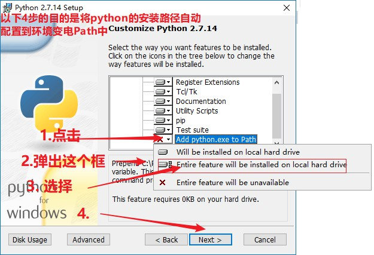
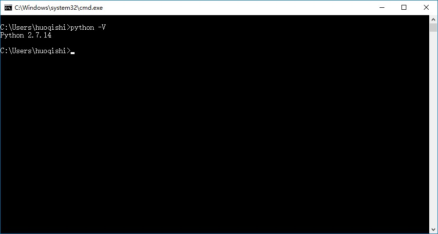
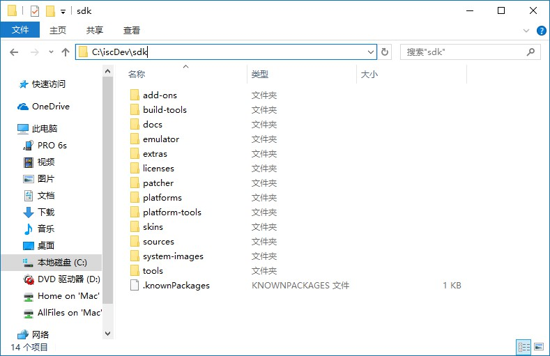
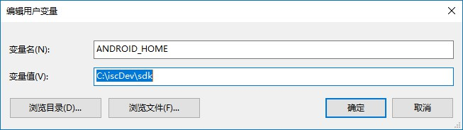
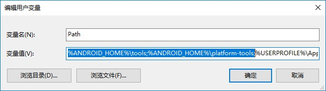
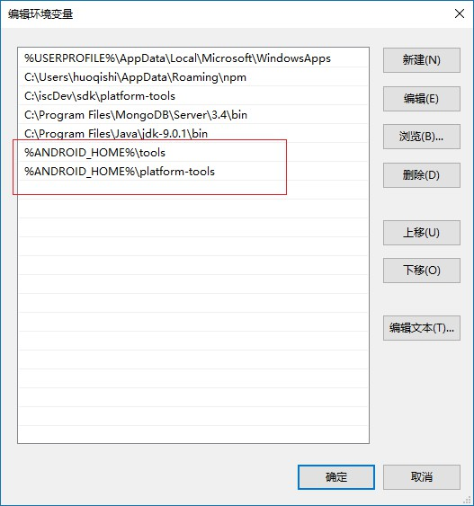

---
基础知识
---


# ReactNative

[英文官网](https://facebook.github.io/react-native/)
[中文文档](http://reactnative.cn/)

## ReactNative 介绍

## 准备工作步骤清单

1. 安装 node.js (强烈配置淘宝镜像源)
2. 安装 git
3. 安装 python 2
4. 安装 jdk
5. 安装 sdk
6. 安装 yarn 和 react-native-cli (react-native官网提供的命令行工具)
7. 安装gradle
8. 启用java代码编译提速(Gradle Deamon)
9. 使用命令行工具初始化项目
10. 运行项目
11. 项目结构介绍

## 准备工作

> 安装必需的软件，以下软件如果电脑上已经安装过了，则无需安装

***

### 安装 node.js

[node.js官网下载页面](https://nodejs.org/en/)

无特殊要求，直接下载最新版安装即可, 默认安装即可

***

### 安装 git

[git官网下载页面](https://git-scm.com/downloads)

无特殊要求，直接下载最新版安装即可，默认安装即可

***

### 安装 python 2

[python官网下载页面](https://www.python.org/downloads/)

*注意: 需要下载 python 2.x 版本， 不支持 python 3.x 版本*

*安装过程唯一需要配置的步骤如下图: *



安装好后在命令行中输入命令: `python -V`查看版本, 如果能够输出版本信息，且为2.x版本，则安装成功。

如下: 



***

### 安装 jdk

[jdk官网下载页面](http://www.oracle.com/technetwork/java/javase/downloads/jdk9-downloads-3848520.html)

从官网下载最新版本，默认安装即可。如果电脑中已经安装,则请确保版本大于等于1.8.0 并小于9.0.0

*把jdk卸载，重新试一下*

**不要修改jdk的安装路径**

***

### 安装 yarn 和 react-native-cli

> 执行命令: `npm install -g yarn react-native-cli`

***

### 安装 gradle

在c盘用户文件夹中新建一个名为 **`.gradle`** 的文件夹，将 `gradle-wrapper.rar` 中的文件解压到该文件夹中

*注意:  文件夹是以`.` 开头的,  右键新建时，需要输入 `.gradle.`  前后各一个 `.` 这样就能新建成功了*

***

### 安装 sdk

1. 解压

> 新建一个名为sdk的文件夹，将 sdk.rar 中的文件解压到该文件夹中。（请确保解压路径中无中文，无空格）

我这里是解压到了如下路径: `c:\iscDev\sdk`, 如图:



1. 配置环境变量

   2.1 新建环境变量(***注意这一步一定不能省***)

   ​	变量名: `ANDROID_HOME`

   ​        变量值: `c:\iscDev\sdk`         注意这里的路径，取决于你当时解压到的路径，并不一定和我一样。

   如图: 

   ​

   2.2 将sdk文件夹中的`tools` 和 `platform-tools` 文件夹路径配置到环境变量PATH中。

   ​       变量名: PATH

   ​       变量值: 追加  `%ANDROID_HOME%\tools` 和 `%ANDROID_HOME%\platform-tools`

   如图: 

   **如果是 win10 的话，PATH变量的配置界面，可能如下图:**

   如图:  


------

## 自动初始化项目结构

> 使用 react-native init 命令初始化一个基本的项目结构

命令说明:  `react-native init <文件夹名>`

命令作用: 会在当前命令行所在路径生成一个命令中指定的文件夹, 文件夹中就包含项目的初始代码
命令示例: `react-native init testApp`

## 运行代码

> 首先确保, 【电脑已经安装并打开手机模拟器】，或者【已经使用数据线将手机连接到电脑, 需要启用**开发人员选项**】。

cd 到上面 testApp 文件夹中， 然后执行命令: `react-native run-android` 来运行代码!


# 常用的组件用户及API

```清单
组件学习: View, Text, Image, Button, TexxtInput, ScrollView, FlatList
其他API: Platform, Dimensions, StyleSheet
样式系统: 默认全部是 `{display: flex, flexDirection: 'column'}`
```

## View

相当于div, 用于布局，但是【不能包含文字】

## Text

> 【用于包裹文字】
> 所有在双标签中间的文字，都必需使用 Text 组件包裹

## Image

## Button

## TextInput

```jsx
import React, { Component } from 'react';
import { TextInput } from 'react-native';
export default const App = () => (
  <TextInput
    multiline
    numberOfLines
    autoFocus={false}
    editable = {true}
    maxLength = {40}
   />
)
```

> TextInput 属性介绍

| 属性名             | 属性值类型    | 默认值   | 属性的作用                                    |
| --------------- | -------- | ----- | ---------------------------------------- |
| value           | string   | 无     | 给文本框指定内容                                 |
| autoFocus       | boolean  | false | 是否自动获取焦点                                 |
| secureTextEntry | booleam  | false | 是否遮挡输入的文字                                |
| placeholder     | string   | 无     | 未输入时的提示信息                                |
| onChange        | function | 无     | change事件 `(event) => event.nativeEvent.text` |
| onSubmitEditing | function | 无     | 按下回车时的提交事件                               |
| returnKeyLabel  | string   |       | 指定手机回车回键上的文字                             |
| multiline       | boolean  | false | 是否使用多行输入                                 |
| onChangeText    | function | 无     | changeText事件 `(text) => text`            |

------

## ScrollView

> 用于滚动，需要指定一个高度, 内部的元素超出指定的高度，则可以滚动

## FlatList

```jsx
import React, { Component } from 'react';
import { FlatList } from 'react-native';
export default const App = () => (
  <FlatList
  data={[{key: 'a'}, {key: 'b'}]}
  renderItem={({item}) => <Text>{item.key}</Text>}
/>
)
```

| 属性名        | 属性值类型    | 默认值  | 作用                                   |
| ---------- | -------- | ---- | ------------------------------------ |
| data       | Array    |      | 指定要渲染的数组                             |
| renderItem | function |      | 该方法形参为data中的某一条数据，要求返回一个react 元素用于渲染 |
|            |          |      |                                      |
|            |          |      |                                      |
|            |          |      |                                      |


------

# 处理触摸事件

> RN中大部分组件不能够注册点击事件, 比如 View, Text。 如果需要给这些组件注册事件，则需要在这些
>
> 组件外层包裹: `Touchable` 开头的组件, 如下:
>
> **TouchableHighlight**
>
> **TouchableNativeFeedback** (仅安卓中可以使用)
>
> **TouchableOpacity**
>
> **TouchableWithoutFeedback**

可以给以上4个组件添加`onPress` 属性来注册点击事件，或者添加`onLongPress`来注册长按事件!

```jsx
// 示例
import {TouchableOpacity} from 'react-native'
const App = () => (
  <TouchableOpacity onPress={e => alert('点击事件')}>
    <View>
      <Text>登陆</Text>
    </View>
  </TouchableOpacity>
)
```


# ReactNative的Api

## Platform

> 自动根据不同的运行平台得到不同的结果!

```jsx
import {Platform} from 'react-native'
const str = Platform.select({
  ios: '我是ios，我爱自己的祖国',
  android: '我是android,我爱自己的祖国'
})
console.log(str)
```

## Dimensions

> 获取屏幕的宽高
>
> **注意: 当手机旋转时，宽高可能会发生变化**

```js
import {Dimesions} from 'react-native'
const {height, width} = Dimensions.get('window');
```

## StyleSheet

> 用于定义样式

```jsx
import {Dimesions, View} from 'react-native'
import React, {Component} from 'react'
const Btn = () => (
  <View style={styles.yyy}><Text style={styles.xxx}>你好</Text></View>
)
const styles = StyleSheet.create({
  xxx: {
    color: '#000',
    fontSize: '18'
  },
  yyy: {
    width: 100,
    height: 200
  }
})
```

# 路由 (react-navigation)

[英文官方文档](https://reactnavigation.org)

> 下载路由

`yarn add react-navigation`

##如何使用!

> 1.  StackRouter

```jsx
import {StackRouter} from 'react-navigation'
const StackRouter = StackNavigator({
  Detail: {
    screen: DetailScreen,
    navigationOptions: {
      headerTitle: '详情'
    }
  },
  newTopic: {
    screen: NewTopicScreen,
    navigationOptions: {
      headerTitle: '发表新话题'
    }
  }
})
const App = () => (<StackRouter />)
export Default App
```

> 2. TabNavigator

```jsx
import {StackRouter} from 'react-navigation'
// Tab路由配置
const optionsA = {
  Home: {
    screen: HomeScreen,
    navigationOptions: {
      header: null,
      tabBarLabel: '首页',
      tabBarIcon: ({focused, tintColor}) => (
        <Image />
      )
    }
  },

  Mine: {
    screen: MineScreen,
    navigationOptions: {
      headerTitle: '个人中心',
      tabBarLabel: '我的',
      tabBarIcon: ({focused, tintColor}) => (
        <Image />
      )
    }
  }
}

// tab导航栏配置
const optionsB = {
  tabBarPosition: 'bottom', // 导航栏位置
  tabBarOptions: {
    activeTintColor: '#06c1ae',
    inactiveTintColor: '#979797',
    style: {
      backgroundColor: '#ffffff',
      height: 49
    },
    labelStyle: {
      fontSize: 14 // 文字大小
    }
  }

}
const TabBar = TabNavigator(optionsA, optionsB)
export default TabBar
```

### 详细配置大全

> StackNavigator

```jsx
StackNavigator({
  XX: {
    navigationOptions：配置StackNavigator的一些属性。  
  
    title：标题，如果设置了这个导航栏和标签栏的title就会变成一样的，不推荐使用  
    header：可以设置一些导航的属性，如果隐藏顶部导航栏只要将这个属性设置为null  
    headerTitle：设置导航栏标题，推荐  
    headerBackTitle：设置跳转页面左侧返回箭头后面的文字，默认是上一个页面的标题。可以自定义，也可以设置为null  
    headerTruncatedBackTitle：设置当上个页面标题不符合返回箭头后的文字时，默认改成"返回"  
    headerRight：设置导航条右侧。可以是按钮或者其他视图控件  
    headerLeft：设置导航条左侧。可以是按钮或者其他视图控件  
    headerStyle：设置导航条的样式。背景色，宽高等  
    headerTitleStyle：设置导航栏文字样式  
    headerBackTitleStyle：设置导航栏‘返回’文字样式  
    headerTintColor：设置导航栏颜色  
    headerPressColorAndroid：安卓独有的设置颜色纹理，需要安卓版本大于5.0  
    gesturesEnabled：是否支持滑动返回手势，iOS默认支持，安卓默认关闭  
   
  
screen：对应界面名称，需要填入import之后的页面  
  
mode：定义跳转风格  
  
   card：使用iOS和安卓默认的风格  
  
   modal：iOS独有的使屏幕从底部画出。类似iOS的present效果  
  
headerMode：返回上级页面时动画效果  
  
   float：iOS默认的效果  
  
   screen：滑动过程中，整个页面都会返回  
  
   none：无动画  
  
cardStyle：自定义设置跳转效果  
  
   transitionConfig： 自定义设置滑动返回的配置  
  
   onTransitionStart：当转换动画即将开始时被调用的功能  
  
   onTransitionEnd：当转换动画完成，将被调用的功能  
  
  path：路由中设置的路径的覆盖映射配置  

  initialRouteName：设置默认的页面组件，必须是上面已注册的页面组件  

  initialRouteParams：初始路由参数  

  }
})
```


> TabNavigator

```jsx
TabNavigator({
  screen：和导航的功能是一样的，对应界面名称，可以在其他页面通过这个screen传值和跳转。  
  navigationOptions：配置TabNavigator的一些属性  

      title：标题，会同时设置导航条和标签栏的title  

      tabBarVisible：是否隐藏标签栏。默认不隐藏(true)  

      tabBarIcon：设置标签栏的图标。需要给每个都设置  

      tabBarLabel：设置标签栏的title。推荐 
}, {
  tabBarPosition：设置tabbar的位置，iOS默认在底部，安卓默认在顶部。（属性值：'top'，'bottom'）  
  
  swipeEnabled：是否允许在标签之间使用手指进行滑动  

  animationEnabled：是否在更改标签时显示动画  

  lazy：是否根据需要懒惰呈现标签，而不是提前，意思是在app打开的时候将底部标签栏全部加载，默认false,推荐为true  
  trueinitialRouteName： 设置默认的页面组件  

  backBehavior：按 back 键是否跳转到第一个Tab(首页)， none 为不跳转  

  tabBarOptions：配置标签栏的一些属性iOS属性  

  activeTintColor：label和icon的前景色 活跃状态下  

  activeBackgroundColor：label和icon的背景色 活跃状态下  

  inactiveTintColor：label和icon的前景色 不活跃状态下  

  inactiveBackgroundColor：label和icon的背景色 不活跃状态下  

  showLabel：是否显示label，默认开启 style：tabbar的样式  

  labelStyle：label的样式安卓属性  

  activeTintColor：label和icon的前景色 活跃状态下  

  inactiveTintColor：label和icon的前景色 不活跃状态下  

  showIcon：是否显示图标，默认关闭  

  showLabel：是否显示label，默认开启 style：tabbar的样式  

  labelStyle：label的样式 upperCaseLabel：是否使标签大写，默认为true  

  pressColor：material涟漪效果的颜色（安卓版本需要大于5.0）  

  pressOpacity：按压标签的透明度变化（安卓版本需要小于5.0）  

  scrollEnabled：是否启用可滚动选项卡 tabStyle：tab的样式  

  indicatorStyle：标签指示器的样式对象（选项卡底部的行）。安卓底部会多出一条线，可以将height设置为0来暂时解决这个问题  

  labelStyle：label的样式  

  iconStyle：图标样式 
})
```


# 补充说明

> 在 `cmd` 中执行如下代码, 可以使得打包过程更为快速一些

```bash
(if not exist "%USERPROFILE%/.gradle" mkdir "%USERPROFILE%/.gradle") && (echo org.gradle.daemon=true >> "%USERPROFILE%/.gradle/gradle.properties")
```


## 解决连接手机容易中断问题

1. 安装之后，可以使用无线连接，来更新
   a. 让手机和电脑连接同一个局域网(wifi)

   b. 电脑开热点让手机连接

   c. 手机开热点让电脑连接

2. 查看电脑ip -. 是【无线网卡】的IP

   摇一摇手机 - 选择 【Dev-Setting】 然后在倒数第三个选项中，输入自己的ip:8081

   **注意点: 如果电脑连接的wifi换了，手机上输入的地址也要变换**


### 总结

今天最重要的是环境!

5.x

